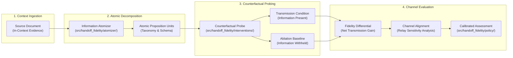

# Transmission vs Reconstruction (handoff-fidelity)

[](LICENSE)
[](pyproject.toml)
[](#research-status--scope)
[](pyproject.toml)
[](https://x.com/SupratikSarkar_)

> **A causal measurement and benchmarking toolkit for distinguishing genuine transmitted information from prior-based hallucination and reconstruction in chained language-model workflows.**

---

## Overview

When one language model hands work to another in a chained or multi-agent workflow, the receiving model routinely states facts the sending model never communicated. Because modern foundation models are trained on massive corpora, a receiver often **reconstructs** plausible claims from surrounding context and its own internal parametric memory.

Measuring only endpoint correctness cannot separate the two mechanisms: an item that survived a handoff and an item that was dropped and subsequently guessed produce identical downstream outputs. However, their failure modes are fundamentally distinct:
* **Transmitted information** persists across out-of-distribution entities and domain shifts.
* **Reconstructed information** degrades sharply when applied to unfamiliar domains, proprietary context, or private data.

**`handoff-fidelity`** provides evaluation harnesses and counterfactual ablation tooling to measure communication fidelity across intermediate handoffs:
* **Transmission Measurement**: Tracking which specific factual units survive lossy handoffs and summarization boundaries.
* **Reconstruction Baseline**: Isolating background guessing and prior-driven reconstruction through counterfactual ablation.
* **Fidelity Scoring**: Computing calibrated communication effectiveness and channel contribution across chained language-model relays.
* **Relay Benchmarking**: Evaluating multi-hop relays across diverse context compression ratios and model pairings.

```
+-------------------------------------------------------------------------------------------------+
|                                    COMMUNICATION FIDELITY FLOW                                  |
|                                                                                                 |
|   [ Source Document ]        [ Information Atomizer ]          [ Counterfactual Evaluation ]    |
|   • Raw text context         • Atomic Fact Extraction          • Present in Handoff Condition   |
|   • Document paragraphs ---> • Proposition Classification ---> • Ablated Context Condition      |
|                              • Entity Relationships            • Net Transmission Differential  |
|                                                                • Channel Fidelity Evaluation    |
+-------------------------------------------------------------------------------------------------+
```



---

## Research Status & Scope

* **Classification**: `ONGOING RESEARCH` (Collaborative research implementation).
* **Collaboration Context**: Collaborative research exploration associated with Indian Statistical Institute (ISI) Kolkata.
* **Status**: Active research implementation and evaluation framework (`handoff-fidelity v0.2.0`).
* **Double-Blind Review Notice**: To comply with double-blind review conventions, this repository provides open-source measurement software, intervention harnesses, and validation runbooks. Anonymous manuscript drafts, confidential submission identifiers, and private review artifacts are intentionally omitted.

---

## Implemented Toolkit Modules

| Subsystem | Module | Description |
| :--- | :--- | :--- |
| **Information Atomizer** | `src/handoff_fidelity/atomizer/` | Decomposes documents into atomic propositions, schema types, and verify rules. |
| **Intervention Probes**| `src/handoff_fidelity/interventions/` | Evaluates counterfactual availabilities and baseline estimation engines. |
| **Relay Orchestration** | `src/handoff_fidelity/relay/` | Executes multi-hop model handoffs across diverse context compression ratios. |
| **Decision Policy Engine**| `src/handoff_fidelity/policy/` | Threshold-based decision logic and routing based on verified communication fidelity. |
| **Telemetry & Observability** | `src/handoff_fidelity/telemetry/` | OpenTelemetry and LangSmith tracing for span-level inspection across relays. |
| **Export & Reporting** | `src/handoff_fidelity/export/` | Publication-ready tabular summaries, reporting exports, and distribution figures. |

---

## Quick Start & Usage

### 1. Installation
Requires Python 3.12:
```bash
# Clone the repository
git clone https://github.com/supratik-sarkar/transmission-vs-reconstruction.git
cd transmission-vs-reconstruction

# Create and activate environment
python3 -m venv .venv
source .venv/bin/activate

# Install package in development mode
pip install -e .
```

### 2. Running an Intervention Audit
Execute the command-line evaluation runner:
```bash
python -m handoff_fidelity --help
```

### 3. Running Unit and Regression Tests
```bash
pytest tests/ -q
```

---

## Repository Structure

```text
transmission-vs-reconstruction/
├── configs/            # Experiment configurations and model parameter sets
├── docs/               # Protocol definitions and evaluation runbooks
├── policies/           # Verification policies and threshold schemas
├── schemas/            # JSON Schema definitions for atom inventories and records
├── src/
│   └── handoff_fidelity/
│       ├── atomizer/       # Atomic fact extraction, validation, and taxonomies
│       ├── baselines/      # Control baselines and external comparison harnesses
│       ├── export/         # Figure generation, table formatting, and reporting checks
│       ├── interventions/  # Counterfactual prior probes and ablation engines
│       ├── policy/         # Decision routing and threshold engines
│       ├── relay/          # Multi-agent handoff task runners
│       └── telemetry/      # OpenTelemetry and LangSmith instrumentation
├── tests/              # Comprehensive test suite covering atomic units and measurement harnesses
├── pyproject.toml      # Build metadata (name: handoff-fidelity v0.2.0)
└── LICENSE             # MIT License
```

---

## Portfolio Navigation

Part of the **Research Systems Portfolio** by [Supratik Sarkar](https://github.com/supratik-sarkar):
* [transmission-vs-reconstruction](https://github.com/supratik-sarkar/transmission-vs-reconstruction) — Channel-theoretic analysis of generative representation models.
* [proof-carrying-multi-agents](https://github.com/supratik-sarkar/proof-carrying-multi-agents) — Proof-carrying generation and verification in multi-agent systems.
* [quantifying-hallucinations](https://github.com/supratik-sarkar/quantifying-hallucinations) — Spectral hypergraph diffusion for multimodal hallucination bounding.
* [safe-discharge-summary](https://github.com/supratik-sarkar/safe-discharge-summary) — Grounding and clinical safety audit frameworks.
