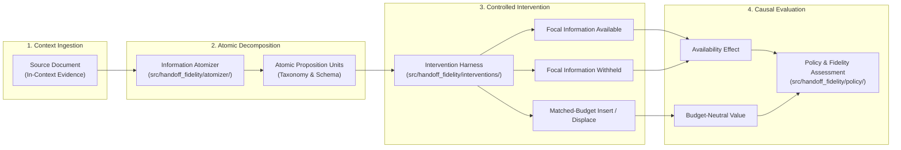

# Transmission vs Reconstruction (handoff-fidelity)

[](LICENSE)
[](pyproject.toml)
[](#research-status--scope)
[](#research-status--scope)

> **A causal measurement and benchmarking toolkit for separating information that was actually available across an LLM handoff from information reconstructed by the receiving model after omission.**

---

## Overview

Language-model systems increasingly pass intermediate work between agents, models, and context-processing stages. A downstream answer can be correct even when some of the supporting information never crossed the handoff: the receiving model may reconstruct it from the remaining context or from its own learned priors.

That makes endpoint correctness an incomplete measure of communication fidelity. `handoff-fidelity` provides intervention-based tooling for asking a more specific question:

> **What did the downstream model recover because the information was available in the handoff, and what could it recover even when that information was withheld?**

The v1-1 research snapshot supports four closely related capabilities:

- **Transmission / Availability Measurement** — estimate how downstream recovery changes when a focal information unit is made available versus withheld while the relevant non-focal context is controlled.
- **Focal-Omission Reconstruction Measurement** — quantify what the receiver can still recover when the focal information unit is removed from the handoff.
- **Budget-Neutral Value Measurement** — distinguish information that matters in principle from information worth preserving when communication capacity is fixed and one retained unit may displace another.
- **Relay Benchmarking** — compare handoff and compression policies under controlled intervention, budget, and receiver conditions.

---

## Why This Problem Matters

Modern AI systems are increasingly modular: one model retrieves, another summarizes, another reasons, and another produces the final answer. In these pipelines, a successful endpoint does not necessarily imply a faithful intermediate communication channel.

This ambiguity matters most when the receiver's prior knowledge is least trustworthy: new facts, changed values, proprietary context, unfamiliar entities, or information that post-dates model training. A system that appears reliable on familiar examples can therefore depend on reconstruction without exposing that dependence in ordinary accuracy metrics.

There is also a measurement problem. Real relays do not omit information randomly: they may preferentially retain salient, surprising, or apparently important content and drop information that looks predictable. Measuring only naturally omitted content can therefore confound **what the relay chose to send** with **what the receiver could reconstruct**.

`handoff-fidelity` is designed to make those mechanisms experimentally separable.

---

## What Is Distinctive Here?

Most compression and relay evaluations ask whether the final task still succeeds, whether a summary is semantically similar, or how much text can be removed. Those questions are useful, but they do not identify why a downstream model succeeded.

This project focuses on a different layer of the problem:

1. **Causal availability rather than surface similarity**
   The core measurement comes from controlled availability interventions on focal information units, not from semantic overlap alone.

2. **Reconstruction is measured under focal omission**
   Recovery after withholding a focal unit is treated as its own observable outcome, rather than being silently counted as successful transmission.

3. **Availability value and budget value are different quantities**
   An information unit can matter when added while still being a poor use of scarce communication capacity. The toolkit therefore separates causal availability effects from matched-budget displacement/allocation effects.

4. **The relay is treated as an assignment mechanism**
   Because a sender or compressor chooses what survives, natural handoff data can be selection-biased. The intervention harness is built to evaluate that mechanism explicitly.

5. **Measurement, policy evaluation, and provenance are kept separate**
   Experiment configuration, intervention records, receiver conditions, and reporting artifacts are structured so that causal measurements can be inspected independently of downstream policy comparisons.

---

## Communication Fidelity Flow

```text
+-------------------------------------------------------------------------------------------------+
|                                    COMMUNICATION FIDELITY FLOW                                  |
|                                                                                                 |
|   [ Source Document ]        [ Information Atomizer ]          [ Causal Evaluation ]            |
|   • Raw text context         • Atomic Fact Extraction          • Focal Present Condition        |
|   • Document paragraphs ---> • Proposition Classification ---> • Focal Withheld Condition       |
|                              • Entity Relationships            • Availability Effect            |
|                                                                • Budget-Neutral Comparison      |
+-------------------------------------------------------------------------------------------------+
```


```mermaid
flowchart LR
    subgraph Input["1. Context Ingestion"]
        DOC["Source Document\n(In-Context Evidence)"]
    end

    subgraph Atom["2. Atomic Decomposition"]
        ATOM["Information Atomizer\n(src/handoff_fidelity/atomizer/)"]
        UNITS["Atomic Proposition Units\n(Taxonomy & Schema)"]
    end

    subgraph Intervene["3. Controlled Intervention"]
        PROBE["Intervention Harness\n(src/handoff_fidelity/interventions/)"]
        PRES["Focal Information Available"]
        ABL["Focal Information Withheld"]
        SWAP["Matched-Budget Insert / Displace"]
    end

    subgraph Decomp["4. Causal Evaluation"]
        AV["Availability Effect"]
        BU["Budget-Neutral Value"]
        EVAL["Policy & Fidelity Assessment\n(src/handoff_fidelity/policy/)"]
    end

    DOC --> ATOM --> UNITS --> PROBE
    PROBE --> PRES & ABL --> AV
    PROBE --> SWAP --> BU
    AV & BU --> EVAL
```

---

## Research Status & Scope

- **Classification**: `ONGOING RESEARCH`.
- **Status**: Active research implementation and evaluation framework; current public research snapshot: **v1-1**.
- **Scope**: Causal measurement of information availability, focal-omission reconstruction, and value-aware allocation across language-model handoffs.
- **Open-Source Distribution Notice**: This repository provides measurement software, intervention harnesses, experiment configuration, validation tooling, and reproducibility-oriented utilities. Manuscript drafts, submission materials, and private review artifacts are intentionally maintained separately.
- **Interpretation Boundary**: Results produced by this toolkit are conditional on the specified intervention, receiver, task, and communication-budget design. The repository should not be interpreted as establishing universal guarantees across models, domains, or deployment settings.

---

## Implemented Toolkit Modules

| Subsystem | Module | Description |
| :--- | :--- | :--- |
| **Information Atomizer** | `src/handoff_fidelity/atomizer/` | Decomposes documents into atomic propositions, schema types, and verification records. |
| **Intervention Probes** | `src/handoff_fidelity/interventions/` | Constructs controlled focal-availability, omission, and counterfactual intervention conditions. |
| **Relay Orchestration** | `src/handoff_fidelity/relay/` | Executes language-model handoff tasks across controlled context and communication-budget conditions. |
| **Decision Policy Engine** | `src/handoff_fidelity/policy/` | Evaluates routing and information-selection policies using measured handoff quantities. |
| **Telemetry & Observability** | `src/handoff_fidelity/telemetry/` | Provides span-level instrumentation for inspecting relay execution and experiment traces. |
| **Export & Reporting** | `src/handoff_fidelity/export/` | Produces tabular summaries, reporting artifacts, figures, and consistency checks. |

---

## Quick Start & Usage

### 1. Installation

Requires Python 3.12:

```bash
# Clone the anonymous/public repository
git clone <repository-url>
cd transmission-vs-reconstruction

# Create and activate environment
python3 -m venv .venv
source .venv/bin/activate

# Install package in development mode
pip install -e .
```

### 2. Running an Intervention Audit

Execute the command-line evaluation runner:

```bash
python -m handoff_fidelity --help
```

### 3. Running Unit and Regression Tests

```bash
pytest tests/ -q
```

### 4. Verifying Reproducibility Record Integrity

```bash
python reproducibility/tools/seal_record.py --verify
```

---

## Repository Structure

```text
transmission-vs-reconstruction/
├── configs/            # Experiment configurations and model parameter sets
├── docs/               # Protocol definitions and evaluation runbooks
├── policies/           # Verification policies and threshold schemas
├── reproducibility/    # Protocol contracts, sampling manifests, receipts, and replay runbooks
├── schemas/            # JSON Schema definitions for atom inventories and records
├── src/
│   └── handoff_fidelity/
│       ├── atomizer/       # Atomic fact extraction, validation, and taxonomies
│       ├── baselines/      # Control baselines and external comparison harnesses
│       ├── export/         # Figure generation, table formatting, and reporting checks
│       ├── interventions/  # Controlled availability and counterfactual intervention engines
│       ├── policy/         # Policy evaluation and information-selection logic
│       ├── relay/          # Language-model handoff task runners
│       └── telemetry/      # Experiment tracing and observability instrumentation
├── tests/              # Unit and regression tests for measurement and intervention tooling
├── pyproject.toml      # Python build metadata and package configuration
└── LICENSE             # MIT License
```

---

## License

Released under the [MIT License](LICENSE).
